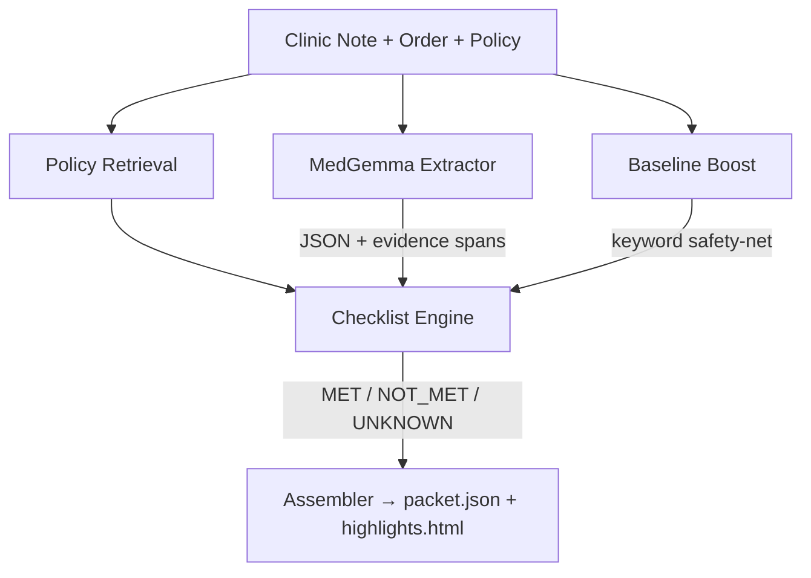

# Agentic Workflow Architecture

**MedGemma 4B-IT (Q4_K_M)** · On-device via `llama-cpp-python` · ~6GB VRAM · No cloud calls

**Key Design Choices:**
- **Provenance Validator** — rejects any evidence quote that isn't an exact substring
- **Baseline Boost** — deterministic keyword + negation matching fills LLM gaps
- **Deterministic Checklist** — rule engine, not free-form LLM reasoning
