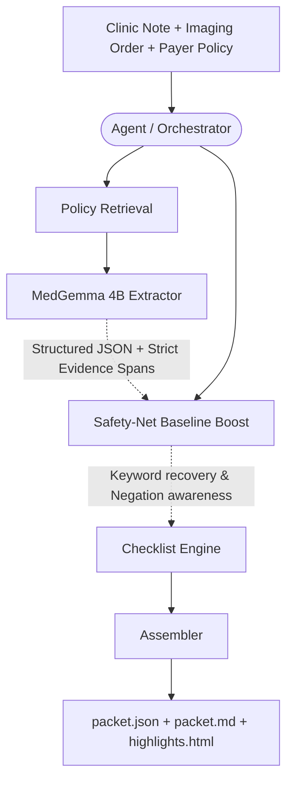

# PA-Trace: Agentic Workflow Architecture

 

 

### Model & Technical Approach
1. **MedGemma 4B-IT (Q4_K_M)** via `llama-cpp-python`.
2. **On-Device Inference**: Runs entirely locally on consumer hardware (~6GB VRAM) for privacy.
3. **Provenance Validator**: A deterministic pipeline rejects any LLM "evidence quote" that isn't a true substring of the clinic note.
4. **Baseline Boost**: Fills gaps in LLM extraction with deterministic keyword and negation matching.
